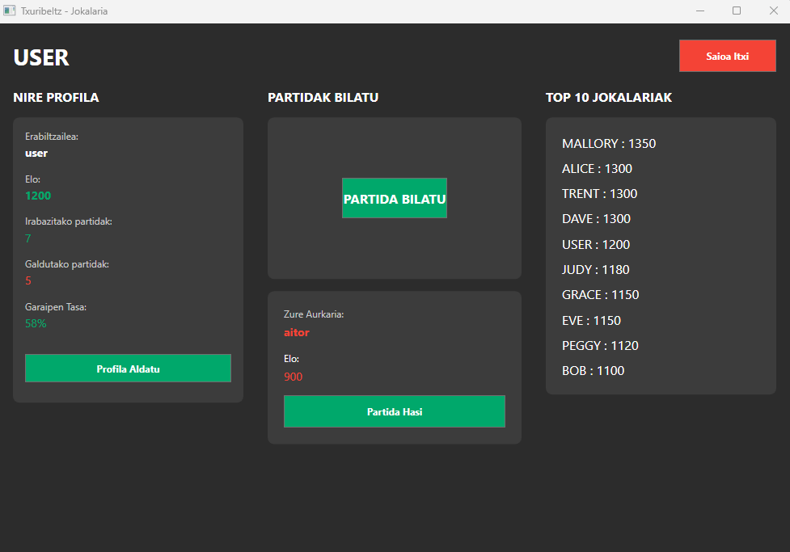
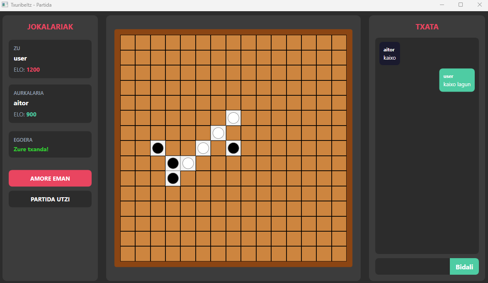
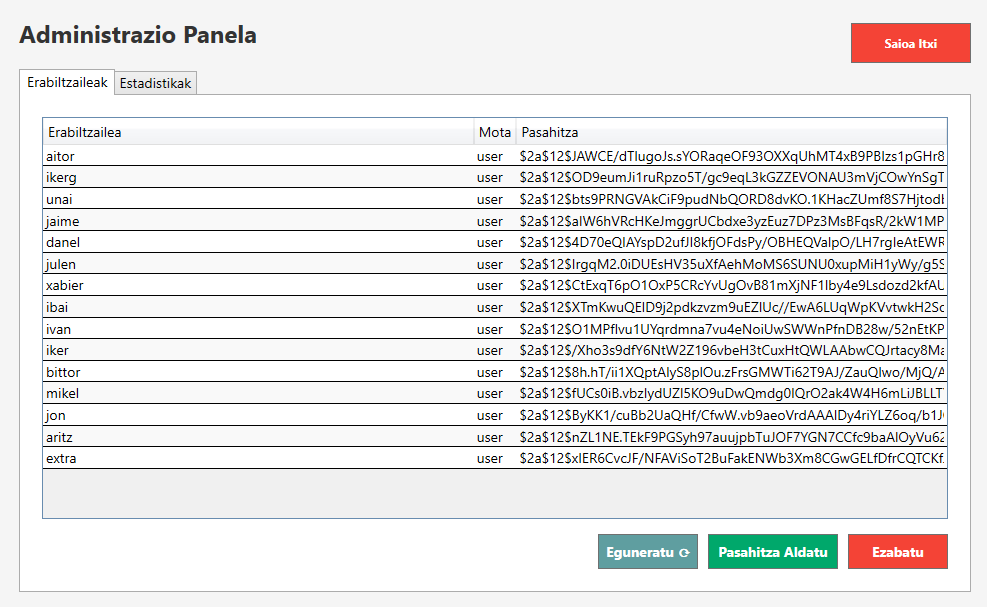

# TXURIBELTZ

- Bertsioa: v1.1
- Egilea: Aitor Gaillard
- Data: 12/2025 - 02/2026
---
## Edukiak
- [Aplikazioaren irudiak](#irudiak)
- [Dokumentazioa](#dokumentazioa)
- [Zer da Txuribeltz?](#zer-da-txuribeltz)
- [Aplikazioaren arkitektura](#aplikazioaren-arkitektura)
- [Aplikazioaren egitura](#aplikazioaren-egitura)
- [Datu-basearen Egitura](#datu-basearen-egitura)
	- [Taulak](#taulak)
		- [erabiltzaileak](#erabiltzaileak---erabiltzaileen-informazioa)
		- [partidak](#partidak---jokatutako-partiden-historikoa)
		- [partida_kola](#partida_kola---ez-erabilia)
- [Nola jarri martxan aplikazioa](#nola-jarri-martxan-aplikazioa)

# Irudiak

## Bezeroa





## Admin



### Dokumentazioa

- [Erabiltzailearen gida](docs/user-guide.md)
- [Administratzailearen gida](docs/admin-guide.md)
- [Gida teknikoa](docs/technical_guide.md)

### Zer da Txuribeltz?

Txuribeltz garatu dudan proiektu bat da non TCP zerbitzari baten bidez (gomuko) 5 fitxa jarraian jartzen datzan joku bat kudeatzen da. Bertan erabiltzaileen artean partidak jokatu daitezke. Proiektuak bi zati ditu, bata TCP zerbitzaria eta bestea TCP bezeroa.

---
### Aplikazioaren arkitektura

Txuribeltz aplikazioa Microsoft WFP .NET8 erabiliz garatu da.
- Interfazearen garapena xaml fitxategien bidez garatu da.
- Logika C# bidez dago garatuta
- Datuetarako sarbidea Docker baten bidez dago prestatuta, zerbitzaria bertara konektatzen da eta bertatik lan egiten du bai irakurriz eta idatziz.
- Datu-basea Docker batean martxan dago postgresql batean.

---
### Aplikazioaren egitura
```bash
txuribeltz_ig_zpp
│
├── 📁 txuribeltz_server/                     # Zerbitzariaren proiektua
│   ├── 📄 txuribeltz_server.csproj           # Zerbitzariaren konfigurazio fitxategia (.NET 8, Console App)
│   ├── 📄 Server.cs                          # TCP zerbitzari nagusia - Bezeroak kudeatu eta konexioak kudeatzen ditu
│   ├── 📄 databaseOperations.cs              # PostgreSQL datu-basearekin lan egiteko operazioak
│   ├── 📄 Partida.cs                         # Partida bat kudeatzen duen klasea (bi jokalari arteko jokoa)
│   ├── 📄 BezeroKonektatuaDatuBasean.cs      # Konektatutako bezero baten informazioa gordetzeko klasea
│   ├── 📄 Erabiltzaile.cs                    # Erabiltzaile baten datuak gordetzeko klasea (admin kudeaketarako)
│   ├── 📄 PasahitzaHashHelper.cs             # Pasahitzak hasheatzeko erabiltzen den klasea
│   └──📁 database_txuribeltz/                # Docker konfigurazioa
│       ├──📄 compose.yaml                    # Docker Compose fitxategia - PostgreSQL datu-basea martxan jartzeko
│       └──📄 initdb.sql                      # Datu-basearen hasierako script-a (taulak eta datuak sortzeko)
│
├── 📁 txuribeltz/                            # Bezeroaren proiektua (WPF)
│   ├── 📄 txuribeltz.csproj                  # Bezeroaren konfigurazio fitxategia (.NET 8, WPF Windows App)
│   ├── 📄 App.xaml                           # WPF aplikazioaren hasierako puntua
│   ├── 📄 App.xaml.cs                        # App.xaml-aren code-behind
│   │
│   ├── 📁 Windows/                           # Lehio guztiak
│   │   ├── 📄 MainWindow.xaml                # Login lehioa - Hasierako lehioa (erabiltzailea logeatzeko)
│   │   ├── 📄 MainWindow.xaml.cs             # Login lehioaren logika
│   │   ├── 📄 AdminWindow.xaml               # Admin lehioa - Erabiltzaileak kudeatzeko eta estatistikak ikusteko
│   │   ├── 📄 AdminWindow.xaml.cs            # Admin lehioaren logika
│   │   ├── 📄 UserWindow.xaml                # Erabiltzaile arruntaren menu nagusia
│   │   ├── 📄 UserWindow.xaml.cs             # Erabiltzaile lehioaren logika (partida bilatu, TOP 10, etab.)
│   │   ├── 📄 MatchWindow.xaml               # Partidaren lehioa - Jokoa jolasten den lekua
│   │   ├── 📄 MatchWindow.xaml.cs            # Partidaren logika (taula, txata, mugimendua)
│   │   ├── 📄 SingUp.xaml                    # Erregistratzeko lehioa - Erabiltzaile berriak sortzeko
│   │   ├── 📄 SingUp.xaml.cs                 # Erregistratzeko logika
│   │   ├── 📄 PasahitzaAldatu.xaml           # Pasahitza aldatzeko lehio txikia
│   │   └── 📄 PasahitzaAldatu.xaml.cs        # Pasahitza aldatzeko logika
│   │
│   ├── 📁 Services/                          # Zerbitzuak
│   │   └── 📄 ValidationService.cs           # Login eta signup baliozkotzeko zerbitzua (unit testetarako)
│   │
│   └── 📄 PdfExport.cs                       # PDF txostenak sortzeko klaseak (QuestPDF erabiliz)
│                                              # - Top10Document: TOP 10 ranking-a PDF-an esportatzeko
│                                              # - UserStatsDocument: Erabiltzaile baten estatistikak PDF-an
│                                              # - PartidaKopuruaDocument: Partida kopurua PDF-an
│
├── 📁 txuribelt_test/                        # Unit test proiektua
│   ├── 📄 txuribelt_test.csproj              # Test proiektuaren konfigurazioa (xUnit)
│   └── 📄 ValidationServiceTests.cs          # ValidationService klaseko testak
│
│
├── 📄 .gitignore                             # Git-ek ez ikusi beharreko fitxategiak
└── 📄 README.md                              # Proiektuaren dokumentazioa

```
## Datu-basearen Egitura

Proiektuak **PostgreSQL** datu-basea erabiltzen du Docker kontainer batean. Datu-basea automatikoki hasieratzen da `docker/initdb.sql` script-aren bidez.

### Taulak

#### *erabiltzaileak* - Erabiltzaileen informazioa
Sistemako erabiltzaile guztien informazioa gordetzen duen taula nagusia.
```bash

| Zutabea      | Mota          | Deskribapena                                          |
|--------------|---------------|-------------------------------------------------------|
| `id`         | SERIAL (PK)   | Erabiltzailearen identifikatzaile bakarra             |
| `username`   | VARCHAR(50)   | Erabiltzaile-izena (login-erako)                      |
| `password`   | VARCHAR(255)  | Pasahitza (testu arrunta, enkriptatu gabe)            |
| `elo`        | INTEGER       | Erabiltzailearen puntuazioa (hasiera: 1000)           |
| `mota`       | VARCHAR(10)   | Erabiltzaile mota: `admin` edo `user` edo `ezabatuta` |
| ~~`avatar`~~ | ~~BYTEA~~     | ~~(Ez inplementatuta)~~                               |
```
**Oharrak:**
- Administratzaileak erabiltzaileak kudeatu ditzake (sortu, ezabatu, pasahitza aldatu)
- ELO puntuazioa partidetan irabazi edo galtzean aldatzen da (+100/-100)
- Hasierako erabiltzaileak: `admin` (admin/admin) eta `user1` (user1/user1)

---

#### **partidak** - Jokatutako partiden historikoa
Jokalarien artean amaitutako partiden erregistroak.
```bash

| Zutabea       | Mota         | Deskribapena                                      |
|---------------|--------------|---------------------------------------------------|
| `id`          | SERIAL (PK)  | Partidaren identifikatzaile bakarra               |
| `player1_id`  | INTEGER (FK) | Lehen jokalariaren ID-a → `erabiltzaileak(id)`    |
| `player2_id`  | INTEGER (FK) | Bigarren jokalariaren ID-a → `erabiltzaileak(id)` |
| `winner_id`   | INTEGER (FK) | Irabazlearen ID-a → `erabiltzaileak(id)`          |
| `played_at`   | TIMESTAMP    | Partida noiz jokatu zen                           |
```
**Oharrak:**
- Partida bat amaitzean automatikoki gordetzen da
- Irabazlearen ELO-a +100 igotzen da, galtzailearena -100 jaisten da
- Admin-ek estatistikak kontsultatu ditzake data-tarteak erabiliz

---

#### *partida_kola* - (EZ ERABILIA)
Partida bat bilatzen ari diren erabiltzaileak kudeatzeko taula.

**Oharra:** Taula hau ez da erabiltzen. Kola zerbitzariaren memorian kudeatzen da `List<BezeroKonektatuaDatuBasean>` erabiliz, efizientzia hobetzeko.

---
## Nola jarri martxan aplikazioa

Aplikazioa datu basea dockerizatuta daukanez,  [Docker desktop](https://www.docker.com/products/docker-desktop/) instalatuta egon behar da. Behin docker compose fitxategiko direktorioan gaudela, terminala ireki eta hurrengo komandoa exekutatu:

```bash
cd database_txuribeltz
docker compose up -d
```
Honek egingo du:
- postgressql datu basea altxatu 5433 portuan
- adminer altxatu 8081 portuan (datu basera interfaze batekin sartzeko).

- [Informazio gehiago behar baduzu irakurri administratzailearen gida](docs/admin-guide.md)

### Honelakoa izango da karpetaren egitura

```
📁 Txuribeltz_v1.1
│
├───📁 app/
│   ├── 📄 Server.exe          # Zerbitzariaren exekutablea
│   ├── 📄 Client.exe          # Bezeroaren exekutablea
│   └── 📄 ...
├───📁 database_txuribeltz/    # Datu basearako beharrezkoak          
│   ├──📄 compose.yaml         # Compose fitxategia          
│   └──📄 initdb.sql           # Datu basea taulekin eta datu fiktizioekin betetzeko script-a
└───📄 README.md               # Githubeko url non informazio guztia gordeta dagoen irakurri ahal izateko
```

Docker martxan daukagula aplikazioa martxan jarri dezakegu. Lehenengo zerbitzaria martxan jarriko da **Server.exe**. Ondoren zerbitzaria martxan dagoenean, bezeroak ireki daitezke **Client.exe** exekutagarriarekin.
Zerbitzaria erakutsiko du bere logean erabili daitezkeen IP helbideak. Ideia da sare berdinean funtzionatzea, adibidez, ez du funtzionatuko WSL edo Dockerren IP-ak jarriz. IP-ak probatu beharko dira zerbitzarira konektatu arte. Bezeroa zerbitzariaren makina berdinean irekitzen bada, **localhost** edo **127.0.0.1** sartuz nahikoa izango da konektatu ahal izateko.