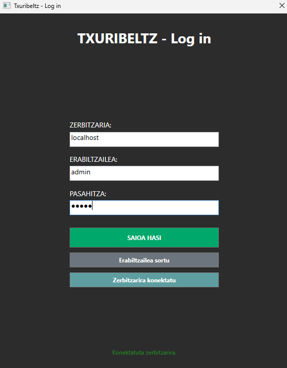
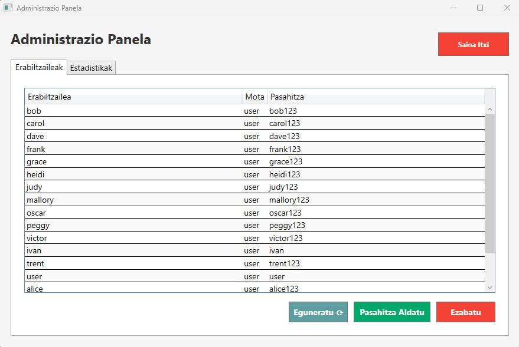
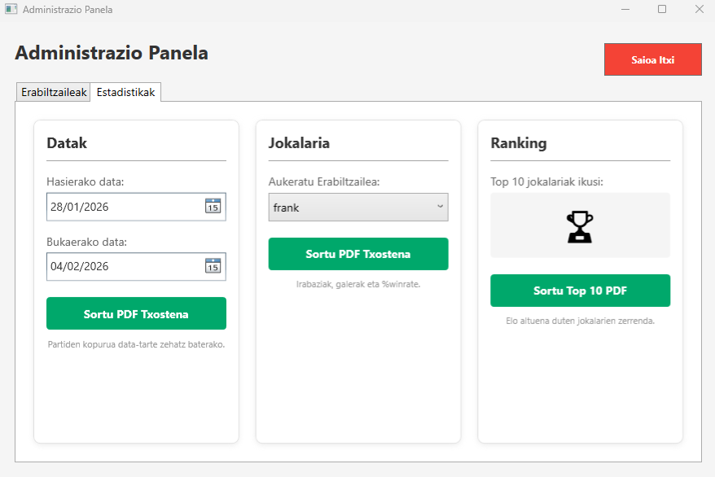

# Administratzailearen gida

## Helburua

Dokumentu honek administratzaileek egin ditzaketen kudeaketak azaltzen ditu. Baita ere aplikazioaren informazio garrantzitsua.

## Docker compose eta postgresql

### 1) PostgreSQL --- 5433 portuan

-   **Erabiltzailea:** admin\
-   **Pasahitza:** admin\
-   **Datu-basearen izena:** txuribeltz\
-   Altxatzean **initdb.sql** scriptak datu-basea populatzen du.

### 2) Adminer --- 8081 portuan

Datu-baseko datuak sortu, editatu, ezabatu eta kontsultatzeko interfaze
grafiko sinple bat.

### Docker compose fitxategia

``` yaml
services:

  db:
    image: postgres
    container_name: postgresql_txuribeltz
    #restart: always
    shm_size: 128mb
    ports:
      - 5433:5432
    
    volumes:
    - ./initdb.sql:/docker-entrypoint-initdb.d/initdb.sql # datubasea inizializatzeko eta datuak sartzeko
    - ./postgresql:/var/lib/postgresql                    # datubasea non gordeko den

    environment:
        POSTGRES_USER: admin                              #datubasearen erabiltzailea
        POSTGRES_PASSWORD: admin                          #datubasearen pasahitza
        POSTGRES_DB: txuribeltz                           #datubasearen izena

  adminer:
    image: adminer
    #restart: always
    ports:
      - 8081:8080
```

## Administratzailearen sarrera
- Zerbitzaria martxan jarri martxan ez badago **Server.exe** fitxategia martxan jarriz.
```bash
Zerbitzaria martxan dago 13000 portuan
Bezeroa ordenagailu honetan badago konektatu IP helbide honekin:              127.0.0.1
Datu basearekin konektatzen...
```
- **Client.exe** fitxategia ireki eta Admin kontuarekin hasi saioa.
```
admin erabiltzailea -> admin
admin pasahitza -> admin
```



## Erabiltzaileak kudeatu

1. Admin leihoan, erabiltzaile-zerrenda ireki.
2. Erabiltzaile berria sortu edo existitzen dena ezabatu.
3. Pasahitza aldatu behar bada, dagokion aukera hautatu.



## Estatistikak ikusi

- Data-tartearen arabera estatistikak filtratu daitezke.
- Emaitzak ikus daitezke eta PDF gisa esportatu.


## PDF esportazioa

- TOP 10, erabiltzailearen estatistikak eta partida kopuruaren txostenak sortu daitezke.
- PDF fitxategiak mahaigainean gordeko dira.