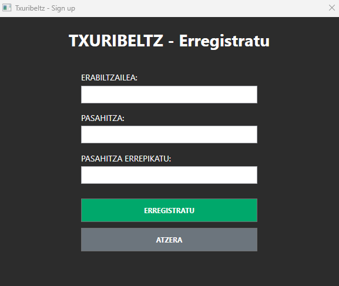

# Erabiltzailearen gida

## Helburua

Dokumentu honek erabiltzaile arruntak aplikazioa nola erabili azalduko du.

## Sarrera

- Aplikazioa WPF bezero batekin exekutatzen da.
- Saioa hasteko erabiltzaile-izena eta pasahitza behar dira.
- **Client.exe** fitxategia ireki eta zure kontuarekin hasi saioa.

- konturik ez badaukazu, sortu dezakezu erabiltzaile berri bat

## Saioa hasi

Hemen erabiltzailearen informazioa, partida bilaketa eta jokalarien top 10 ikusiko duzu.

## Partida bat jokatu

1. Menu nagusian, hautatu partida bilatzea, kolan sartuko zara partida baten bila.
2. Partida aurkitzean aurkalariaren informazioa aterako zaizu.

3. Partida lehioa agertuko da eta partida martxan jarriko da. Partidan bai jokua bai txat bat egongo da aurkalariarekin hitz egiteko.

4. Partida bukatzean lehio nagusira bueltatuko zara.